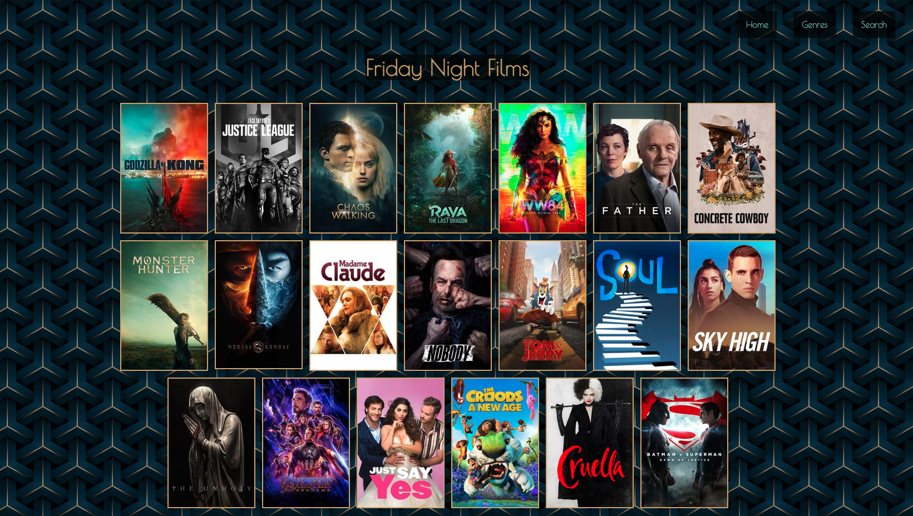
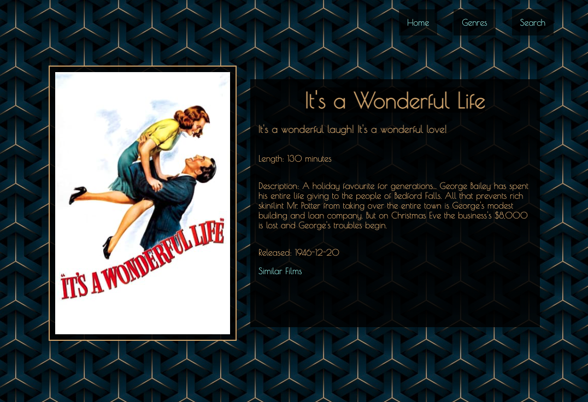
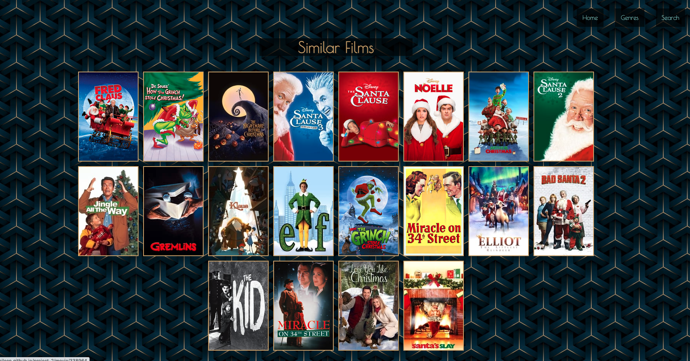
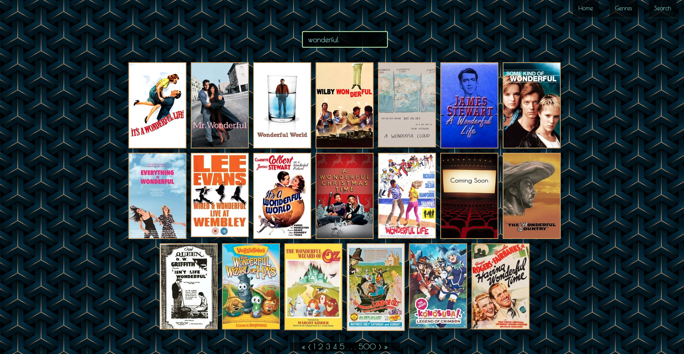
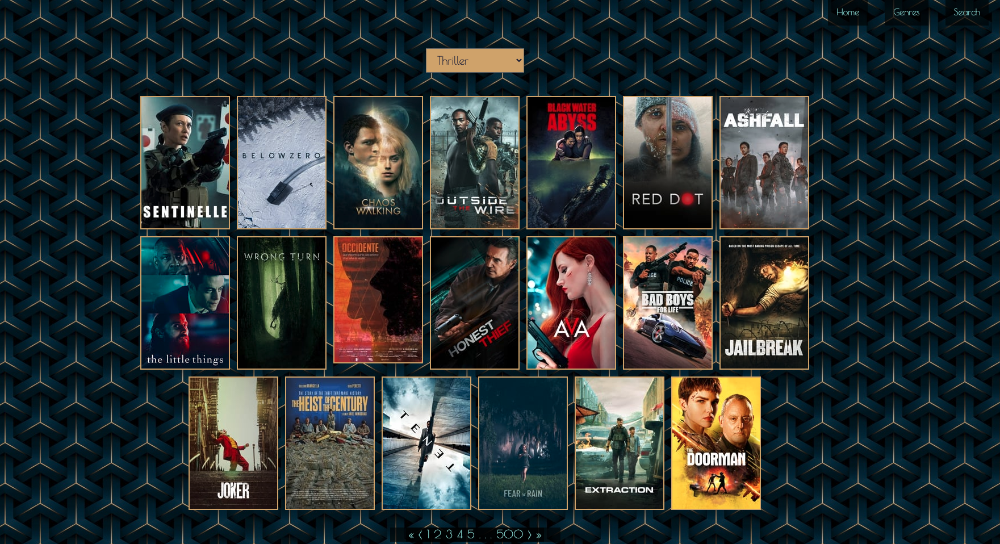

###  General Assembly, Software Engineering Immersive

# Friday Night Films: a React Application 

## Overview
In this 48 hour project, my partner and I created a React app using an existing API from The Movie DB. 

You can view the project here (mobile or desktop): https://emilieeileen.github.io/project-2/
## Tasks
* **Consume a public API** – this could be anything but it must make sense for your project.
* **Have several components** - At least one classical and one functional.
* **The app should include a router** - with several "pages".
* Have **semantically clean HTML** - you make sure you write HTML that makes structural sense rather than thinking about how it might look, which is the job of CSS.
* **Be deployed online** and accessible to the public.

# Technologies Used
- HTML
- SCSS
- React.js
- Git
- Github
- Insomnia
- Axios
- Semantic UI (Pagination component)

### API courtesy of https://www.themoviedb.org/

## Screenshots (using It's a Wonderful Life as the Film Example)

Homepage with Trending Films



Single Movie Page for It's a Wonderful Life


Similar Films to It's a Wonderful Life


Search page searching for the keyword 'wonderful'


Genre Page looking up Thrillers

## Plan
From the beginning, we knew we wanted to work with a film API as there were many accessible and well documented APIs out there for us to be creative with. Looking at other movie database websites, we noted many had similar layouts and color themes, which led u to the decision to create something that visually stood out. Using a color pallette designed from an old Hollywood theatre, we decided on an Art-Deco, Golden Age of Hollywood design for our page. The color pallette also proved useful as the dark blue, light teal and gold tones matched well as a background for many of the movie posters on the database. We also found the PoiretOne font fit in perfectly with our theme, giving our website a vintage, classic feel while showing the latest modern films.

## Functionality
The web app uses React to display the films in a flex wrap grid. Users can click on a film poster to see the information about each individual film. On that page, users may select **Similar Films** which will bring them to a new page that displays all films related to the previous film.

Users can also use the navigation bar to search films by genre or movie title. We wanted to give the users flexibility to search films by multiple means while providing a clean interface to display said films. We imported the *NavBar* each page displays the tabs on the upper right hand corner.

### Home Page
We decided to use the *Trending* endpoint to display 20 trending movies on our home page. This allowed us to fill our page with content and allow the user to easily navigate to the current most popular movies.
```js
const Home = () => {
  const [trending, updateTrending] = useState([])
  const [loading, updateLoading] = useState(true)

  useEffect(() => {
    axios.get(`https://api.themoviedb.org/3/trending/movie/day?api_key=${process.env.API_KEY}`)
      .then(({ data }) => {
        updateTrending(data.results)
        updateLoading(false)
      })
  }, [])

  if (loading){
    return <>
      
      <h1>Loading films...</h1>
    </>
  }

  return <div className='homepage'> 
    <h1 className='title'>Friday Night Films</h1>
    <div className='trendingdiv'>
      {trending.map((movie) => { 
        return <Link key={movie.id} to={`/project-2/movie/${movie.id}`}>
          <div className='trendingcard'>
            
          </div>
        </Link>
      })
      }
    </ div>
  </div>
}
```

### Search & Genres
While TMDB has many endpoints to filter films, we decided to focus on two categories, genres and keywords. Originally, we attempted to hav both of these filters on one Search pag, but given the nature of the endpoints, we separated them into two pages. 

To filter the genre, we created a dropdown menu which list all the genres. Each genre had a numerical value, which corresponded to the id number given by the database. When the page first loads, we have an axios request fetch the basic *Discover* endpoint, showing films by popularity ranking. As the user selects a genre, the APIUrl changes so only films frm that genre are shown. 
``` js
const [apiUrl, setApiUrl] = useState(`https://api.themoviedb.org/3/discover/movie?api_key=${process.env.API_KEY}&language=en-US&sort_by=popularity.desc&include_adult=false&include_video=false&page=1`)


  useEffect(() => {
    axios.get(apiUrl)
      .then(({ data }) => {
        updateDiscoverMovies(data.results)
        updateLoading(false)
      })
  }, [apiUrl])

// Select Menu Logic
<select className='selectGenre' onChange={(event) => {
        updateGenre(event.target.value) 
        setApiUrl(`https://api.themoviedb.org/3/discover/movie?api_key=${process.env.API_KEY}&language=en-US&sort_by=popularity.desc&include_adult=false&include_video=false&page=${pageNo}&with_genres=${Number(event.target.value)}`)
      }}>
```
For Searching, we created a search bar where the user can enter their desired keyword. The initial logic of this page remained similar to the *Genre* page. The useEffect calls an axios effect returns all the films ranked by popularity. When the user enters the keywords, the useEffect calls a new APIUrl, which now includes the keywords. 
``` js
<div className="container">
      <input className='searchFilms' onChange={(event) => {
        updateSearch(event.target.value)
        setApiUrl(`https://api.themoviedb.org/3/search/movie?api_key=${process.env.API_KEY}&language=en-US&query=${event.target.value}&page=${pageNo}&include_adult=false`)
      }} placeholder="Search Movie Titles..."/>
      
    </div>
```

Both the *Genre* and *Search* pages use Pagination. As the API only allowed for 20 items to be called at a given time, the Pagination allowed us to call a new request on each page. We created a **pageChange** constant variable which determined how the APIUrl would be set based how the user chose to filter.

```js
const pageChange = (page, pageInfo) => {
    setActivePage(pageInfo.activePage)
    if (search === '') {
      setApiUrl(`https://api.themoviedb.org/3/discover/movie?api_key=${process.env.API_KEY}&language=en-US&sort_by=popularity.desc&include_adult=false&include_video=false&page=${pageInfo.activePage}`)
    } else {
      setApiUrl(`https://api.themoviedb.org/3/search/movie?api_key=${process.env.API_KEY}&language=en-US&query=${search}&page=${pageInfo.activePage}&include_adult=false`)
    }
    updatePageNo(pageInfo.activePage)
  }
  ```

The pagination component was placed underneath the displayed items, allowing users to click through pages while still being able to view the 20 results per page. The style of the Pagniation was taken from Semantic UI, which kept a simplistic design that fit our art deco theme. We used flexbox CSS styling to display the movie posters on both pages, using h set sizes of the posters to help create the grid of results. We liked how this provided a clean set of results that consistent throughout the website.

```js
 <div className='pagination'>
      <Pagination 
        activePage={activePage}
        onPageChange={pageChange}
        totalPages={500}
        ellipsisItem={'. . .'}/>
    </div>
```
### Single Movie and Similar Films
Using a flexbox design, we wanted to simultaneously highlight teh movie posters, while displaying the relevant information in a clear way. We used match.params to call the id of the desired film. This id was then passed through the useEffect to bring up the data on each film, now classified as 'movie'. Using match, we called each piece of information back to each movie endpoint, as seen below. 

```js
<div className='singlemovie'>
    
    <div className='movieInfo'>
      <h1>{movie.title}</h1>
      <h3 className='movieTag'>{movie.tagline}</h3>
      <p className='movieRuntime'>Length: {movie.runtime} minutes</p>
      <p className='movieOverview'>Description: {movie.overview}</p>
      <p className='movieDate'>Released: {movie.release_date}</p>
      <Link key={movie.id} className='similiarLink' to={`/project-2/similarfilms/${id}`}> Similar Films</Link>
    </div>
  </div>
  ```
We wanted to use the *Similar Films* option from the database as way to include an additional component to the project. As shown above, each movie page links to a Similar films page, where users can see similar films to the one they selected. Using the match similarly to how it was used on the *SingleMovie* page, we called the movie ID to display the array of similar films. this array was then mapped onto a flexbox grid, with teh movie posters acting as the cards. The user can click on the poster to return that films' *SingleMovie* page, just like on th *Genre* and *Search* pages. 

```js
return <div>
    <h1>Similar Films</h1>
    <div className='similarfilmsdiv'>
      {similarFilms.map((similar) => {
        return <Link key={similar.id} to={`/project-2/movie/${similar.id}`} >
          <div className='similarcard'>
            
          </div>
        </Link>
      })}
    </div>
  </div>
### Catching Errors: Missing Posters, Loading Page and No Similar Films
Calling data from the API can take some time an the time lag can stop data from fully loading on the page. To combat this we, we added a loading feature on all of our pages. I created a custom loading image, a stylized cartoon box of popcorn that fit our color scheme and added to the character of the website. 
```js
// Single Movie page loading example
const [loading, updateLoading] = useState(true)
  
  useEffect(() => {
    axios.get(`https://api.themoviedb.org/3/movie/${id}?api_key=${process.env.API_KEY}&language=en-US`)
      .then(({ data }) => {
        updateMovie(data)
        updateLoading(false)
      })
  }, [])

  if (loading){
    return <>
      
      <h1>Loading films...</h1>
    </>
  }
```
While The Movie Database has many items fully fleshed out, some films may not have similar films or a movie poster available. To keep styling consistent, we created a placeholder poster to fill the movie poster space. 
```js
let imageSrc = `https://image.tmdb.org/t/p/w342${movie.poster_path}`
  if (`${movie.poster_path}` === 'null') {
    imageSrc = 'https://i.imgur.com/tl0tdJ8.png'
  }
```
For *Similar Films*, we created a custom div that displayed if no array bof similar films could be found.
```js
if (similarFilms.length === 0) {
    return <h2 className='nosimilar'>No similar films available. Please try another film.</h2>
  }
```
## Bugs
- When on the Genres drop down, if you move to one genre and then return to All Genres the films displayed remain as the last genre selected.

## Wins and Challenges
### Wins
- Successfully mapping the API data onto a webpage, using a hidden API key
- Creating a front end filtering to display results per the user's parameters
- Creating custom loading images and placeholder images for movie's without posters

### Challenges
- Solving the issues with the Discover endpoints. This was the most challenging aspect of the project and I am proud that we found a way to have user filter by searching keywords and genres, even if it is on separate pages.

## Lessons Learned
Both myself and Vesna really enjoyed the paired programming experience. Since this project was only 48 hours, we divided up the work and helped each other when we got stuck on bugs. This allowed us to work to our strengths, splitting up work based on interests. We were both very proud of the result and greatly enjoyed the paired programming experience.

If we were to approach this project again, we may look at a styling framework, such as Bulma or Bootstrap. We chose not to use one as neither of us were fully comfortable with them at the time, but given our exposure to them in subsequent projects, it would present a new and interesting challenge. 
